# Баг-репорты

## БР1: Неверный порядок полей в форме регистрации

**Предусловия:** Пользователь не зарегистрирован

**Шаги воспроизведения:**
1. Открыть главную страницу
2. Нажать в шапке сайта в правом верхнем углу кнопку "Зарегистрироваться"
3. Обратить внимание на порядок полей формы регистрации

**Ожидаемый результат:** В форме регистрации присутствуют поля в порядке: 

Имя
Номер телефона
E-mail
Пароль
Повторите пароль
Адрес доставки
Комментарий к заказу

**Фактический результат:** В форме регистрации присутствуют поля в порядке: 

E-mail
Имя
Пароль
Повторите пароль
Номер телефона
Адрес доставки
Комментарий к заказу

**Окружение:** Windows 11 Pro, Google Chrome 152.0.7977.65 1920x1080

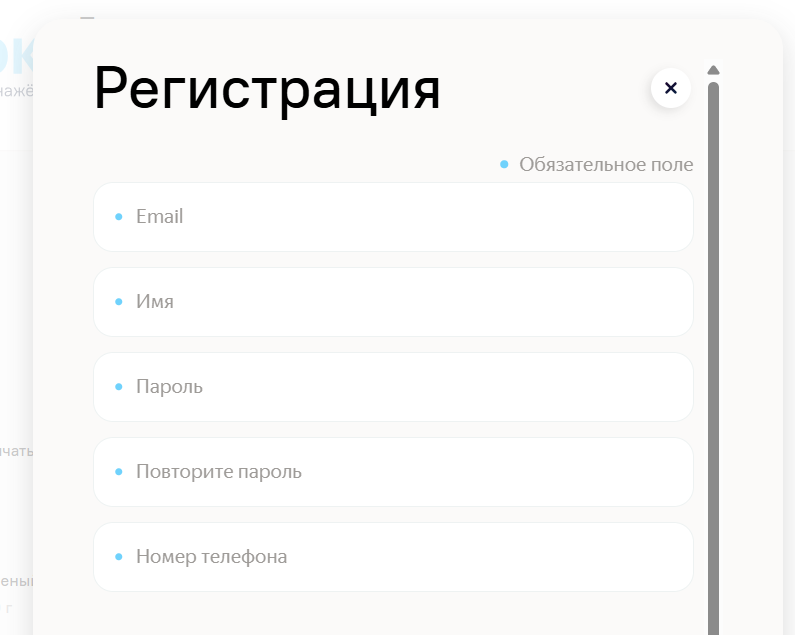

---

## БР2: Неверный порядок полей в форме регистрации

**Предусловия:** Пользователь не зарегистрирован

**Шаги воспроизведения:**
1. Открыть главную страницу
2. Нажать в шапке сайта в правом верхнем углу кнопку "Зарегистрироваться"
3. Обратить внимание на порядок полей формы регистрации

**Ожидаемый результат:** В форме регистрации присутствуют поля в порядке: 

Имя
Номер телефона
E-mail
Пароль
Повторите пароль
Адрес доставки
Комментарий к заказу

**Фактический результат:** В форме регистрации присутствуют поля в порядке: 

E-mail
Имя
Пароль
Повторите пароль
Номер телефона
Адрес доставки
Комментарий к заказу

**Окружение:** Windows 11 Pro, Firefox 154.0.1 1280x720

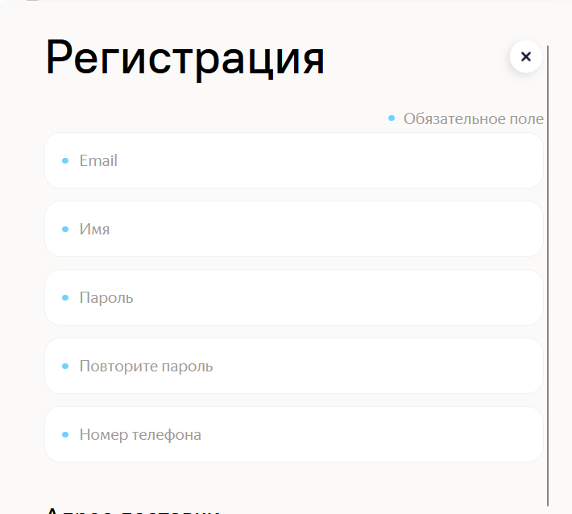

---

## БР3: При успешной регистрации не появляется сообщение об успешной регистрации, сразу происходит переход на главную страницу

**Предусловия:** Пользователь не зарегистрирован

**Шаги воспроизведения:**
1. Открыть главную страницу
2. Нажать в шапке сайта в правом верхнем углу кнопку "Зарегистрироваться"
3. Заполнить обязательные поля валидными данными
4. Внизу формы нажать кнопку "Зарегистрироваться"

**Ожидаемый результат:** Появляется попап с сообщением «Всё получилось!» и крестиком закрытия

**Фактический результат:** Сразу происходит переход на главную страницу

**Окружение:** Windows 11 Pro, Google Chrome 152.0.7977.65 1920x1080

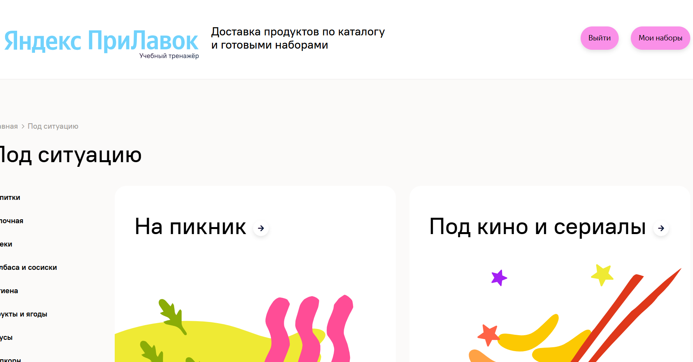

---

## БР4: При успешной регистрации не появляется сообщение об успешной регистрации, сразу происходит переход на главную страницу

**Предусловия:** Пользователь не зарегистрирован

**Шаги воспроизведения:**
1. Открыть главную страницу
2. Нажать в шапке сайта в правом верхнем углу кнопку "Зарегистрироваться"
3. Заполнить обязательные поля валидными данными
4. Внизу формы нажать кнопку "Зарегистрироваться"

**Ожидаемый результат:** Появляется попап с сообщением «Всё получилось!» и крестиком закрытия

**Фактический результат:** Сразу происходит переход на главную страницу

**Окружение:** Windows 11 Pro, Firefox 154.0.1 1280x720

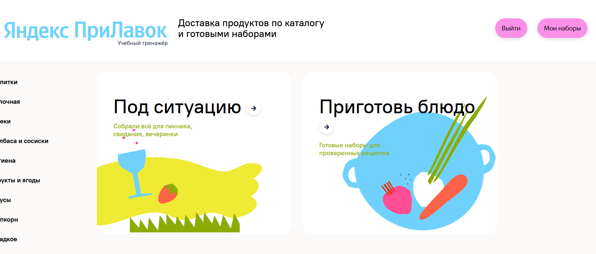

---

## БР5: При регистрации при незаполненном поле Email кнопка "Зарегистрироваться" активна

**Предусловия:** Пользователь не зарегистрирован

**Шаги воспроизведения:**
1. Открыть главную страницу
2. Нажать в шапке сайта в правом верхнем углу кнопку "Зарегистрироваться"
3. Заполнить обязательные поля валидными данными
4. Поле Email оставить пустым
5. Внизу формы обратить внимание на активность кнопки "Зарегистрироваться"

**Ожидаемый результат:** Кнопка «Зарегистрироваться» недоступна для нажатия

**Фактический результат:** Кнопка «Зарегистрироваться» доступна для нажатия

**Окружение:** Windows 11 Pro, Google Chrome 152.0.7977.65 1920x1080

---

## БР6: При регистрации при незаполненном поле Email происходит неверная реакция поля

**Предусловия:** Пользователь не зарегистрирован

**Шаги воспроизведения:**
1. Открыть главную страницу
2. Нажать в шапке сайта в правом верхнем углу кнопку "Зарегистрироваться"
3. Заполнить обязательные поля валидными данными
4. Поле Email оставить пустым и обратить внимание на поле

**Ожидаемый результат:** В поле Email появляется красная точка

**Фактический результат:** Поле Email подсвечивается красным цветом

**Окружение:** Windows 11 Pro, Google Chrome 152.0.7977.65 1920x1080

---

## БР7: При регистрации при незаполненном поле Email не появляется сообщение "Заполните все обязательные поля"

**Предусловия:** Пользователь не зарегистрирован

**Шаги воспроизведения:**
1. Открыть главную страницу
2. Нажать в шапке сайта в правом верхнем углу кнопку "Зарегистрироваться"
3. Заполнить обязательные поля валидными данными
4. Поле Email оставить пустым и обратить внимание на надпись под полем и всеми полями формы

**Ожидаемый результат:** Под всеми полями появляется сообщение «Заполните все обязательные поля»

**Фактический результат:** Под полем Email появляется надпись "Обязательное поле"

**Окружение:** Windows 11 Pro, Google Chrome 152.0.7977.65 1920x1080

---

## БР8: При регистрации при незаполненном поле Email кнопка "Зарегистрироваться" активна

**Предусловия:** Пользователь не зарегистрирован

**Шаги воспроизведения:**
1. Открыть главную страницу
2. Нажать в шапке сайта в правом верхнем углу кнопку "Зарегистрироваться"
3. Заполнить обязательные поля валидными данными
4. Поле Email оставить пустым
5. Внизу формы обратить внимание на активность кнопки "Зарегистрироваться"

**Ожидаемый результат:** Кнопка «Зарегистрироваться» недоступна для нажатия

**Фактический результат:** Кнопка «Зарегистрироваться» доступна для нажатия

**Окружение:** Windows 11 Pro, Firefox 154.0.1 1280x720

---

## БР9: При регистрации при незаполненном поле Email происходит неверная реакция поля

**Предусловия:** Пользователь не зарегистрирован

**Шаги воспроизведения:**
1. Открыть главную страницу
2. Нажать в шапке сайта в правом верхнем углу кнопку "Зарегистрироваться"
3. Заполнить обязательные поля валидными данными
4. Поле Email оставить пустым и обратить внимание на поле

**Ожидаемый результат:** В поле Email появляется красная точка

**Фактический результат:** Поле Email подсвечивается красным цветом

**Окружение:** Windows 11 Pro, Firefox 154.0.1 1280x720

---

## БР10: При регистрации при незаполненном поле Email не появляется сообщение "Заполните все обязательные поля"

**Предусловия:** Пользователь не зарегистрирован

**Шаги воспроизведения:**
1. Открыть главную страницу
2. Нажать в шапке сайта в правом верхнем углу кнопку "Зарегистрироваться"
3. Заполнить обязательные поля валидными данными
4. Поле Email оставить пустым и обратить внимание на надпись под полем и всеми полями формы

**Ожидаемый результат:** Под всеми полями появляется сообщение «Заполните все обязательные поля»

**Фактический результат:** Под полем Email появляется надпись "Обязательное поле"

**Окружение:** Windows 11 Pro, Firefox 154.0.1 1280x720

---

## БР11: При регистрации при незаполненном поле "Пароль" кнопка "Зарегистрироваться" активна

**Предусловия:** Пользователь не зарегистрирован

**Шаги воспроизведения:**
1. Открыть главную страницу
2. Нажать в шапке сайта в правом верхнем углу кнопку "Зарегистрироваться"
3. Заполнить обязательные поля валидными данными
4. Поле "Пароль" оставить пустым
5. Внизу формы обратить внимание на активность кнопки "Зарегистрироваться"

**Ожидаемый результат:** Кнопка «Зарегистрироваться» недоступна для нажатия

**Фактический результат:** Кнопка «Зарегистрироваться» доступна для нажатия

**Окружение:** Windows 11 Pro, Google Chrome 152.0.7977.65 1920x1080

---

## БР12: При регистрации при незаполненном поле "Пароль" происходит неверная реакция поля

**Предусловия:** Пользователь не зарегистрирован

**Шаги воспроизведения:**
1. Открыть главную страницу
2. Нажать в шапке сайта в правом верхнем углу кнопку "Зарегистрироваться"
3. Заполнить обязательные поля валидными данными
4. Поле "Пароль" оставить пустым и обратить внимание на поле

**Ожидаемый результат:** В поле "Пароль" появляется красная точка

**Фактический результат:** Поле "Пароль" подсвечивается красным цветом

**Окружение:** Windows 11 Pro, Google Chrome 152.0.7977.65 1920x1080

---

## БР13: При регистрации при незаполненном поле "Пароль" не появляется сообщение "Заполните все обязательные поля"

**Предусловия:** Пользователь не зарегистрирован

**Шаги воспроизведения:**
1. Открыть главную страницу
2. Нажать в шапке сайта в правом верхнем углу кнопку "Зарегистрироваться"
3. Заполнить обязательные поля валидными данными
4. Поле "Пароль" оставить пустым и обратить внимание на надпись под полем и всеми полями формы

**Ожидаемый результат:** Под всеми полями формы появляется сообщение «Заполните все обязательные поля»

**Фактический результат:** Под полем "Пароль" появляется надпись "Обязательное поле"

**Окружение:** Windows 11 Pro, Google Chrome 152.0.7977.65 1920x1080

---

## БР14: При регистрации при незаполненном поле "Пароль" кнопка "Зарегистрироваться" активна

**Предусловия:** Пользователь не зарегистрирован

**Шаги воспроизведения:**
1. Открыть главную страницу
2. Нажать в шапке сайта в правом верхнем углу кнопку "Зарегистрироваться"
3. Заполнить обязательные поля валидными данными
4. Поле "Пароль" оставить пустым
5. Внизу формы обратить внимание на активность кнопки "Зарегистрироваться"

**Ожидаемый результат:** Кнопка «Зарегистрироваться» недоступна для нажатия

**Фактический результат:** Кнопка «Зарегистрироваться» доступна для нажатия

**Окружение:** Windows 11 Pro, Firefox 154.0.1 1280x720

---

## БР15: При регистрации при незаполненном поле "Пароль" происходит неверная реакция поля

**Предусловия:** Пользователь не зарегистрирован

**Шаги воспроизведения:**
1. Открыть главную страницу
2. Нажать в шапке сайта в правом верхнем углу кнопку "Зарегистрироваться"
3. Заполнить обязательные поля валидными данными
4. Поле "Пароль" оставить пустым и обратить внимание на поле

**Ожидаемый результат:** В поле "Пароль" появляется красная точка

**Фактический результат:** Поле "Пароль" подсвечивается красным цветом

**Окружение:** Windows 11 Pro, Firefox 154.0.1 1280x720

---

## БР16: При регистрации при незаполненном поле "Пароль" не появляется сообщение "Заполните все обязательные поля"

**Предусловия:** Пользователь не зарегистрирован

**Шаги воспроизведения:**
1. Открыть главную страницу
2. Нажать в шапке сайта в правом верхнем углу кнопку "Зарегистрироваться"
3. Заполнить обязательные поля валидными данными
4. Поле "Пароль" оставить пустым и обратить внимание на надпись под полем и всеми полями формы

**Ожидаемый результат:** Под всеми полями формы появляется сообщение «Заполните все обязательные поля»

**Фактический результат:** Под полем "Пароль" появляется надпись "Обязательное поле"

**Окружение:** Windows 11 Pro, Firefox 154.0.1 1280x720

---

## БР17: При регистрации при незаполненном поле "Повторите пароль" кнопка "Зарегистрироваться" активна

**Предусловия:** Пользователь не зарегистрирован

**Шаги воспроизведения:**
1. Открыть главную страницу
2. Нажать в шапке сайта в правом верхнем углу кнопку "Зарегистрироваться"
3. Заполнить обязательные поля валидными данными
4. Поле "Повторите пароль" оставить пустым
5. Внизу формы обратить внимание на активность кнопки "Зарегистрироваться"

**Ожидаемый результат:** Кнопка «Зарегистрироваться» недоступна для нажатия

**Фактический результат:** Кнопка «Зарегистрироваться» доступна для нажатия

**Окружение:** Windows 11 Pro, Google Chrome 152.0.7977.65 1920x1080

**Комментарий:** По требованиям - "по умолчанию кнопка «Зарегистрироваться» активна"

---

## БР18: При регистрации при незаполненном поле "Повторите пароль" происходит неверная реакция поля

**Предусловия:** Пользователь не зарегистрирован

**Шаги воспроизведения:**
1. Открыть главную страницу
2. Нажать в шапке сайта в правом верхнем углу кнопку "Зарегистрироваться"
3. Заполнить обязательные поля валидными данными
4. Поле "Повторите пароль" оставить пустым и обратить внимание на поле

**Ожидаемый результат:** В поле "Повторите пароль" появляется красная точка

**Фактический результат:** Поле "Повторите пароль" подсвечивается красным цветом

**Окружение:** Windows 11 Pro, Google Chrome 152.0.7977.65 1920x1080

---

## БР19: При регистрации при незаполненном поле "Повторите пароль" не появляется сообщение "Заполните все обязательные поля"

**Предусловия:** Пользователь не зарегистрирован

**Шаги воспроизведения:**
1. Открыть главную страницу
2. Нажать в шапке сайта в правом верхнем углу кнопку "Зарегистрироваться"
3. Заполнить обязательные поля валидными данными
4. Поле "Повторите пароль" оставить пустым и обратить внимание на надпись под полем и всеми полями формы

**Ожидаемый результат:** Под всеми полями формы появляется сообщение «Заполните все обязательные поля»

**Фактический результат:** Под полем "Повторите пароль" появляется надпись "Обязательное поле"

**Окружение:** Windows 11 Pro, Google Chrome 152.0.7977.65 1920x1080

---

## БР20: При регистрации при незаполненном поле "Повторите пароль" кнопка "Зарегистрироваться" активна

**Предусловия:** Пользователь не зарегистрирован

**Шаги воспроизведения:**
1. Открыть главную страницу
2. Нажать в шапке сайта в правом верхнем углу кнопку "Зарегистрироваться"
3. Заполнить обязательные поля валидными данными
4. Поле "Повторите пароль" оставить пустым
5. Внизу формы обратить внимание на активность кнопки "Зарегистрироваться"

**Ожидаемый результат:** Кнопка «Зарегистрироваться» недоступна для нажатия

**Фактический результат:** Кнопка «Зарегистрироваться» доступна для нажатия

**Окружение:** Windows 11 Pro, Firefox 154.0.1 1280x720

---

## БР21: При регистрации при незаполненном поле "Повторите пароль" происходит неверная реакция поля

**Предусловия:** Пользователь не зарегистрирован

**Шаги воспроизведения:**
1. Открыть главную страницу
2. Нажать в шапке сайта в правом верхнем углу кнопку "Зарегистрироваться"
3. Заполнить обязательные поля валидными данными
4. Поле "Повторите пароль" оставить пустым и обратить внимание на поле

**Ожидаемый результат:** В поле "Повторите пароль" появляется красная точка

**Фактический результат:** Поле "Повторите пароль" подсвечивается красным цветом

**Окружение:** Windows 11 Pro, Firefox 154.0.1 1280x720

---

## БР22: При регистрации при незаполненном поле "Повторите пароль" не появляется сообщение "Заполните все обязательные поля"

**Предусловия:** Пользователь не зарегистрирован

**Шаги воспроизведения:**
1. Открыть главную страницу
2. Нажать в шапке сайта в правом верхнем углу кнопку "Зарегистрироваться"
3. Заполнить обязательные поля валидными данными
4. Поле "Повторите пароль" оставить пустым и обратить внимание на надпись под полем и всеми полями формы

**Ожидаемый результат:** Под всеми полями формы появляется сообщение «Заполните все обязательные поля»

**Фактический результат:** Под полем "Повторите пароль" появляется надпись "Обязательное поле"

**Окружение:** Windows 11 Pro, Firefox 154.0.1 1280x720

---

## БР23: На странице регистрации нет ссылки "У вас уже есть аккаунт? Войти"

**Предусловия:** Пользователь зарегистрирован, не авторизован

**Шаги воспроизведения:**
1. Открыть главную страницу
2. Нажать в шапке сайта в правом верхнем углу кнопку "Зарегистрироваться"
3. Внизу формы регистрации нажать ссылку "У вас уже есть аккаунт? Войти"

**Ожидаемый результат:** Переход на экран авторизации

**Фактический результат:** Отсутствует ссылка "У вас уже есть аккаунт? Войти"

**Окружение:** Windows 11 Pro, Google Chrome 152.0.7977.65 1920x1080

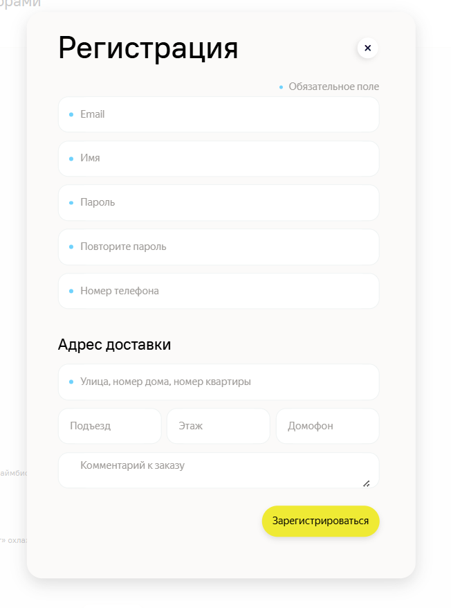

---

## БР24: На странице регистрации нет ссылки "У вас уже есть аккаунт? Войти"

**Предусловия:** Пользователь зарегистрирован, не авторизован

**Шаги воспроизведения:**
1. Открыть главную страницу
2. Нажать в шапке сайта в правом верхнем углу кнопку "Зарегистрироваться"
3. Обратить внимание на нижнюю часть формы регистрации

**Ожидаемый результат:** Переход на экран авторизации

**Фактический результат:** Отсутствует ссылка "У вас уже есть аккаунт? Войти"

**Окружение:** Windows 11 Pro, Firefox 154.0.1 1280x720

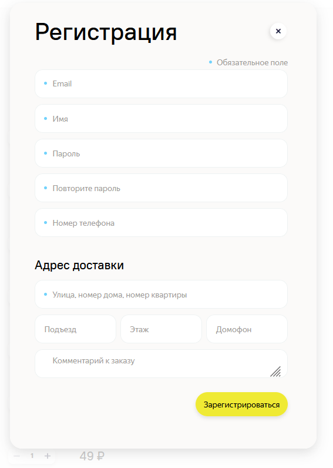

---

## БР25: При авторизации с пустым Email при нажатии кнопки «Войти» под полем «Email» появляется сообщение об ошибке красным текстом: «Обязательное поле»

**Предусловия:** Пользователь зарегистрирован, не авторизован

**Шаги воспроизведения:**
1. Открыть главную страницу
2. Нажать в шапке сайта в правом верхнем углу кнопку "Войти"
3. Заполнить поле "Пароль" валидными данными зарегистрированного пользователя
4. Поле Email оставить пустым
5. Нажать кнопку "Войти" внизу формы
6. Обратить внимание на надпись под полем Email

**Ожидаемый результат:** Появляется сообщение об ошибке красным текстом: «Email является обязательным»

**Фактический результат:** Появляется сообщение об ошибке красным текстом: «Обязательное поле»

**Окружение:** Windows 11 Pro, Google Chrome 152.0.7977.65 1920x1080

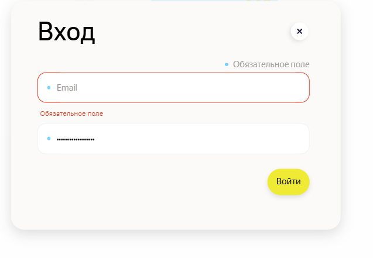

---

## БР26: При авторизации с пустым Email при нажатии кнопки «Войти» под полем «Email» появляется сообщение об ошибке красным текстом: «Обязательное поле»

**Предусловия:** Пользователь зарегистрирован, не авторизован

**Шаги воспроизведения:**
1. Открыть главную страницу
2. Нажать в шапке сайта в правом верхнем углу кнопку "Войти"
3. Заполнить поле "Пароль" валидными данными зарегистрированного пользователя
4. Поле Email оставить пустым
5. Нажать кнопку "Войти" внизу формы
6. Обратить внимание на надпись под полем Email

**Ожидаемый результат:** Появляется сообщение об ошибке красным текстом: «Email является обязательным»

**Фактический результат:** Появляется сообщение об ошибке красным текстом: «Обязательное поле»

**Окружение:** Windows 11 Pro, Firefox 154.0.1 1280x720

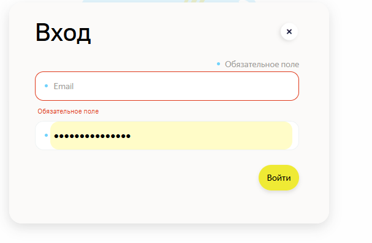

---

## БР27: При авторизации с пустым полем «Пароль» при нажатии кнопки «Войти» под полем появляется сообщение об ошибке красным текстом: «Обязательное поле»

**Предусловия:** Пользователь зарегистрирован, не авторизован

**Шаги воспроизведения:**
1. Открыть главную страницу
2. Нажать в шапке сайта в правом верхнем углу кнопку "Войти"
3. Заполнить поле Email валидными данными зарегистрированного пользователя
4. Поле "Пароль" оставить пустым
5. Нажать кнопку "Войти" внизу формы
6. Обратить внимание на надпись под полем "Пароль"

**Ожидаемый результат:** Под полем появляется сообщение об ошибке красным текстом: «Пароль является обязательным»

**Фактический результат:** Под полем появляется сообщение об ошибке красным текстом: «Обязательное поле»

**Окружение:** Windows 11 Pro, Google Chrome 152.0.7977.65 1920x1080

---

## БР28: При авторизации с пустым полем «Пароль» при нажатии кнопки «Войти» под полем появляется сообщение об ошибке красным текстом: «Обязательное поле»

**Предусловия:** Пользователь зарегистрирован, не авторизован

**Шаги воспроизведения:**
1. Открыть главную страницу
2. Нажать в шапке сайта в правом верхнем углу кнопку "Войти"
3. Заполнить поле Email валидными данными зарегистрированного пользователя
4. Поле "Пароль" оставить пустым
5. Нажать кнопку "Войти" внизу формы
6. Обратить внимание на надпись под полем "Пароль"

**Ожидаемый результат:** Под полем появляется сообщение об ошибке красным текстом: «Пароль является обязательным»

**Фактический результат:** Под полем появляется сообщение об ошибке красным текстом: «Обязательное поле»

**Окружение:** Windows 11 Pro, Firefox 154.0.1 1280x720

---

## БР29: При авторизации с некорректными данными под полями выводится ошибка: «Пользователь с такими данными не найден»

**Предусловия:** Пользователь зарегистрирован, не авторизован

**Шаги воспроизведения:**
1. Открыть главную страницу
2. Нажать в шапке сайта в правом верхнем углу кнопку "Войти"
3. Заполнить поля некорректными валидными данными зарегистрированного пользователя
4. Нажать кнопку "Войти" внизу формы
5. Обратить внимание на надпись под полями внизу формы

**Ожидаемый результат:** Ошибка: «Неправильные логин и/или пароль»

**Фактический результат:** Ошибка: «Пользователь с такими данными не найден»

**Окружение:** Windows 11 Pro, Google Chrome 152.0.7977.65 1920x1080

---

## БР30: При авторизации с некорректными данными под полями выводится ошибка: «Пользователь с такими данными не найден»

**Предусловия:** Пользователь зарегистрирован, не авторизован

**Шаги воспроизведения:**
1. Открыть главную страницу
2. Нажать в шапке сайта в правом верхнем углу кнопку "Войти"
3. Заполнить поля некорректными валидными данными зарегистрированного пользователя
4. Нажать кнопку "Войти" внизу формы
5. Обратить внимание на надпись под полями внизу формы

**Ожидаемый результат:** Ошибка: «Неправильные логин и/или пароль»

**Фактический результат:** Ошибка: «Пользователь с такими данными не найден»

**Окружение:** Windows 11 Pro, Firefox 154.0.1 1280x720

---

## БР31: При регистрации при незаполненном поле "Имя" кнопка "Зарегистрироваться" активна

**Предусловия:** Пользователь не зарегистрирован

**Шаги воспроизведения:**
1. Открыть главную страницу
2. Нажать в шапке сайта в правом верхнем углу кнопку "Зарегистрироваться"
3. Заполнить обязательные поля валидными данными
4. Поле "Имя" оставить пустым
5. Внизу формы обратить внимание на активность кнопки "Зарегистрироваться"

**Ожидаемый результат:** Кнопка «Зарегистрироваться» недоступна для нажатия

**Фактический результат:** Кнопка «Зарегистрироваться» доступна для нажатия

**Окружение:** Windows 11 Pro, Google Chrome 152.0.7977.65 1920x1080

---

## БР32: При регистрации при незаполненном поле "Имя" происходит неверная реакция поля

**Предусловия:** Пользователь не зарегистрирован

**Шаги воспроизведения:**
1. Открыть главную страницу
2. Нажать в шапке сайта в правом верхнем углу кнопку "Зарегистрироваться"
3. Заполнить обязательные поля валидными данными
4. Поле "Имя" оставить пустым и обратить внимание на поле

**Ожидаемый результат:** В поле "Имя" появляется красная точка

**Фактический результат:** Поле "Имя" подсвечивается красным цветом

**Окружение:** Windows 11 Pro, Google Chrome 152.0.7977.65 1920x1080

---

## БР33: При регистрации при незаполненном поле "Имя" не появляется сообщение "Заполните все обязательные поля"

**Предусловия:** Пользователь не зарегистрирован

**Шаги воспроизведения:**
1. Открыть главную страницу
2. Нажать в шапке сайта в правом верхнем углу кнопку "Зарегистрироваться"
3. Заполнить обязательные поля валидными данными
4. Поле "Имя" оставить пустым и обратить внимание на надпись под полем и всеми полями формы

**Ожидаемый результат:** Под всеми полями формы появляется сообщение «Заполните все обязательные поля»

**Фактический результат:** Под полем "Имя" появляется надпись "Обязательное поле"

**Окружение:** Windows 11 Pro, Google Chrome 152.0.7977.65 1920x1080

---

## БР34: При регистрации при незаполненном поле "Имя" кнопка "Зарегистрироваться" активна

**Предусловия:** Пользователь не зарегистрирован

**Шаги воспроизведения:**
1. Открыть главную страницу
2. Нажать в шапке сайта в правом верхнем углу кнопку "Зарегистрироваться"
3. Заполнить обязательные поля валидными данными
4. Поле "Имя" оставить пустым
5. Внизу формы обратить внимание на активность кнопки "Зарегистрироваться"

**Ожидаемый результат:** Кнопка «Зарегистрироваться» недоступна для нажатия

**Фактический результат:** Кнопка «Зарегистрироваться» доступна для нажатия

**Окружение:** Windows 11 Pro, Firefox 154.0.1 1280x720

---

## БР35: При регистрации при незаполненном поле "Имя" происходит неверная реакция поля

**Предусловия:** Пользователь не зарегистрирован

**Шаги воспроизведения:**
1. Открыть главную страницу
2. Нажать в шапке сайта в правом верхнем углу кнопку "Зарегистрироваться"
3. Заполнить обязательные поля валидными данными
4. Поле "Имя" оставить пустым и обратить внимание на поле

**Ожидаемый результат:** В поле "Имя" появляется красная точка

**Фактический результат:** Поле "Имя" подсвечивается красным цветом

**Окружение:** Windows 11 Pro, Firefox 154.0.1 1280x720

---

## БР36: При регистрации при незаполненном поле "Имя" не появляется сообщение "Заполните все обязательные поля"

**Предусловия:** Пользователь не зарегистрирован

**Шаги воспроизведения:**
1. Открыть главную страницу
2. Нажать в шапке сайта в правом верхнем углу кнопку "Зарегистрироваться"
3. Заполнить обязательные поля валидными данными
4. Поле "Имя" оставить пустым и обратить внимание на надпись под полем и всеми полями формы

**Ожидаемый результат:** Под всеми полями формы появляется сообщение «Заполните все обязательные поля»

**Фактический результат:** Под полем "Имя" появляется надпись "Обязательное поле"

**Окружение:** Windows 11 Pro, Firefox 154.0.1 1280x720

---

## БР37: Происходит регистрация при незаполненном поле "Номер телефона"

**Предусловия:** Пользователь не зарегистрирован

**Шаги воспроизведения:**
1. Открыть главную страницу
2. Нажать в шапке сайта в правом верхнем углу кнопку "Зарегистрироваться"
3. Заполнить обязательные поля валидными данными
4. Поле "Номер телефона" оставить пустым
5. Нажать под полями формы кнопку "Зарегистрироваться"

**Ожидаемый результат:** Кнопка «Зарегистрироваться» недоступна для нажатия, регистрация не происходит

**Фактический результат:** Происходит регистрация и переход на главную страницу

**Окружение:** Windows 11 Pro, Google Chrome 152.0.7977.65 1920x1080

---

## БР38: Происходит регистрация при незаполненном поле "Номер телефона"

**Предусловия:** Пользователь не зарегистрирован

**Шаги воспроизведения:**
1. Открыть главную страницу
2. Нажать в шапке сайта в правом верхнем углу кнопку "Зарегистрироваться"
3. Заполнить обязательные поля валидными данными
4. Поле "Номер телефона" оставить пустым
5. Нажать под полями формы кнопку "Зарегистрироваться"

**Ожидаемый результат:** Кнопка «Зарегистрироваться» недоступна для нажатия, регистрация не происходит

**Фактический результат:** Происходит регистрация и переход на главную страницу

**Окружение:** Windows 11 Pro, Firefox 154.0.1 1280x720

---

## БР39: При регистрации при незаполненном поле адреса кнопка "Зарегистрироваться" активна

**Предусловия:** Пользователь не зарегистрирован

**Шаги воспроизведения:**
1. Открыть главную страницу
2. Нажать в шапке сайта в правом верхнем углу кнопку "Зарегистрироваться"
3. Заполнить обязательные поля валидными данными
4. Поле адреса оставить пустым
5. Внизу формы обратить внимание на активность кнопки "Зарегистрироваться"

**Ожидаемый результат:** Кнопка «Зарегистрироваться» недоступна для нажатия

**Фактический результат:** Кнопка «Зарегистрироваться» доступна для нажатия

**Окружение:** Windows 11 Pro, Google Chrome 152.0.7977.65 1920x1080

**Комментарий:** По требованиям - "по умолчанию кнопка «Зарегистрироваться» активна"

---

## БР40: При регистрации при незаполненном поле адреса происходит неверная реакция поля

**Предусловия:** Пользователь не зарегистрирован

**Шаги воспроизведения:**
1. Открыть главную страницу
2. Нажать в шапке сайта в правом верхнем углу кнопку "Зарегистрироваться"
3. Заполнить обязательные поля валидными данными
4. Поле адреса оставить пустым и обратить внимание на поле

**Ожидаемый результат:** В поле адреса появляется красная точка

**Фактический результат:** Поле адреса выделяется красным цветом

**Окружение:** Windows 11 Pro, Google Chrome 152.0.7977.65 1920x1080

---

## БР41: При регистрации при незаполненном поле адреса не появляется сообщение "Заполните все обязательные поля"

**Предусловия:** Пользователь не зарегистрирован

**Шаги воспроизведения:**
1. Открыть главную страницу
2. Нажать в шапке сайта в правом верхнем углу кнопку "Зарегистрироваться"
3. Заполнить обязательные поля валидными данными
4. Поле адреса оставить пустым и обратить внимание на надпись под полем и всеми полями формы

**Ожидаемый результат:** Под всеми полями формы появляется сообщение «Заполните все обязательные поля»

**Фактический результат:** Под полем адреса появляется сообщение «Обязательное поле»

**Окружение:** Windows 11 Pro, Google Chrome 152.0.7977.65 1920x1080

---

## БР42: При регистрации при незаполненном поле адреса кнопка "Зарегистрироваться" активна

**Предусловия:** Пользователь не зарегистрирован

**Шаги воспроизведения:**
1. Открыть главную страницу
2. Нажать в шапке сайта в правом верхнем углу кнопку "Зарегистрироваться"
3. Заполнить обязательные поля валидными данными
4. Поле адреса оставить пустым
5. Внизу формы обратить внимание на активность кнопки "Зарегистрироваться"

**Ожидаемый результат:** Кнопка «Зарегистрироваться» недоступна для нажатия

**Фактический результат:** Кнопка «Зарегистрироваться» доступна для нажатия

**Окружение:** Windows 11 Pro, Firefox 154.0.1 1280x720

---

## БР43: При регистрации при незаполненном поле адреса происходит неверная реакция поля

**Предусловия:** Пользователь не зарегистрирован

**Шаги воспроизведения:**
1. Открыть главную страницу
2. Нажать в шапке сайта в правом верхнем углу кнопку "Зарегистрироваться"
3. Заполнить обязательные поля валидными данными
4. Поле адреса оставить пустым и обратить внимание на поле

**Ожидаемый результат:** В поле адреса появляется красная точка

**Фактический результат:** Поле адреса выделяется красным цветом

**Окружение:** Windows 11 Pro, Firefox 154.0.1 1280x720

---

## БР44: При регистрации при незаполненном поле адреса не появляется сообщение "Заполните все обязательные поля"

**Предусловия:** Пользователь не зарегистрирован

**Шаги воспроизведения:**
1. Открыть главную страницу
2. Нажать в шапке сайта в правом верхнем углу кнопку "Зарегистрироваться"
3. Заполнить обязательные поля валидными данными
4. Поле адреса оставить пустым и обратить внимание на надпись под полем и всеми полями формы

**Ожидаемый результат:** Под всеми полями формы появляется сообщение «Заполните все обязательные поля»

**Фактический результат:** Под полем адреса появляется сообщение «Обязательное поле»

**Окружение:** Windows 11 Pro, Firefox 154.0.1 1280x720

---

## БР45: Запрос POST api/v1/users с пустым полем phone возвращает ответ 201 Created

**Предусловия:** Пользователь не зарегистрирован

**Шаги воспроизведения:**
1. В Postman сформировать запрос POST api/v1/users с адресом сервиса:
{
  "firstName": "",
  "phone": "",
  "address": "",
  "email": "",
  "password": ""
}
2. Заполнить все поля валидными данными
3. Поле phone оставить пустым
4. Отправить запрос

**Ожидаемый результат:** Запрос возвращает ответ 400 Bad request

**Фактический результат:** Запрос возвращает ответ 201 Created

**Окружение:** Postman

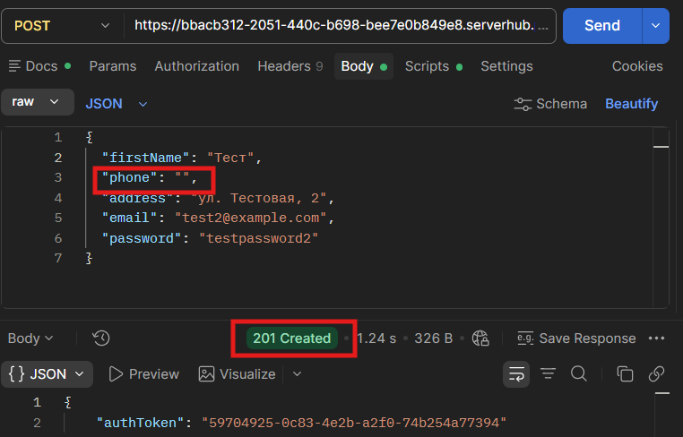

---

## БР46: При регистрации с незаполненным полем "Телефон" данные сохраняются в базу данных

**Предусловия:** Пользователь зарегистрирован

**Шаги воспроизведения:**
1. Подключиться к сервису в DBeaver
2. Сформировать запрос с почтой зарегистрированного пользователя SELECT * FROM user_model WHERE email = '';
3. Отправить запрос

**Ожидаемый результат:** Данные не сохранены в БД

**Фактический результат:** Данные сохранены в БД

**Окружение:** DBeaver

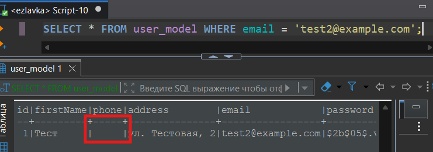

---

## БР47: При прокрутке формы регистрации не появляется футер формы: ссылка «У вас уже есть аккаунт» и кнопка «Войти»

**Предусловия:** Пользователь не зарегистрирован

**Шаги воспроизведения:**
1. Открыть главную страницу
2. Нажать в шапке сайта в правом верхнем углу кнопку "Зарегистрироваться"
3. Обратить внимание на нижнюю часть формы регистрации

**Ожидаемый результат:** При прокрутке формы регистрации появляется футер формы: ссылка «У вас уже есть аккаунт» и кнопка «Войти»

**Фактический результат:** При прокрутке формы регистрации не появляется футер формы: ссылка «У вас уже есть аккаунт» и кнопка «Войти»

**Окружение:** Windows 11 Pro, Google Chrome 152.0.7977.65 1920x1080

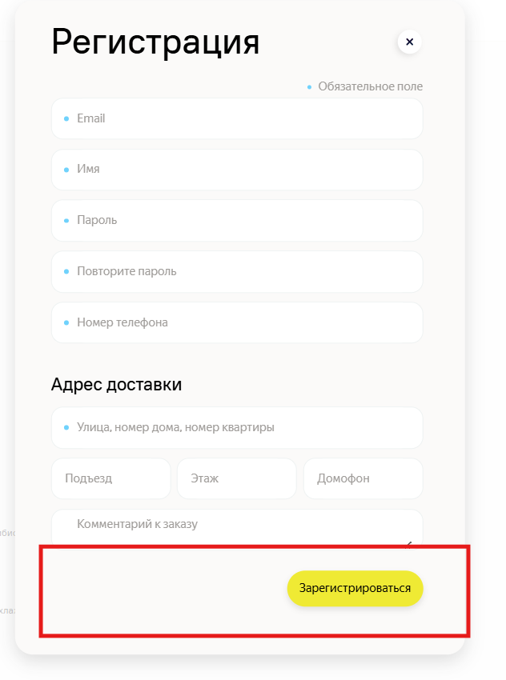

---

## БР48: При прокрутке формы регистрации не появляется футер формы: ссылка «У вас уже есть аккаунт» и кнопка «Войти»

**Предусловия:** Пользователь не зарегистрирован

**Шаги воспроизведения:**
1. Открыть главную страницу
2. Нажать в шапке сайта в правом верхнем углу кнопку "Зарегистрироваться"
3. Обратить внимание на нижнюю часть формы регистрации

**Ожидаемый результат:** При прокрутке формы регистрации появляется футер формы: ссылка «У вас уже есть аккаунт» и кнопка «Войти»

**Фактический результат:** При прокрутке формы регистрации не появляется футер формы: ссылка «У вас уже есть аккаунт» и кнопка «Войти»

**Окружение:** Firefox 
(версия 154.0.1) 
1280x720

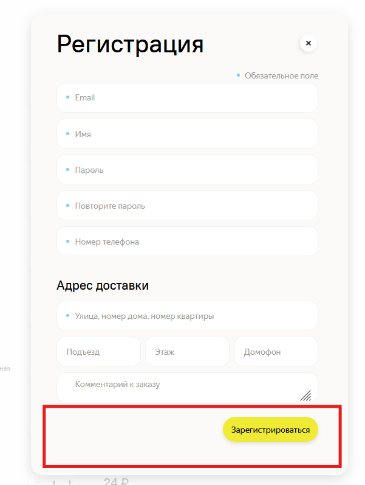

---

## БР49: При вводе значения в поле адреса с пробелами в начале адреса, пробелы не удаляются после снятия фокуса

**Предусловия:** Пользователь не зарегистрирован

**Шаги воспроизведения:**
1. Открыть главную страницу
2. Нажать в шапке сайта в правом верхнем углу кнопку "Зарегистрироваться"
3. Заполнить обязательные поля валидными данными
4. Поле адреса заполнить с несколькими пробелами в начале адреса
5. Нажать кнопку "Зарегистрироваться"

**Ожидаемый результат:** Пробелы удаляются после снятия фокуса

**Фактический результат:** Пробелы не удаляются после снятия фокуса

**Окружение:** Windows 11 Pro, Google Chrome 152.0.7977.65 1920x1080

---

## БР50: При вводе значения в поле адреса с пробелами в начале адреса, пробелы не удаляются после снятия фокуса

**Предусловия:** Пользователь не зарегистрирован

**Шаги воспроизведения:**
1. Открыть главную страницу
2. Нажать в шапке сайта в правом верхнем углу кнопку "Зарегистрироваться"
3. Заполнить обязательные поля валидными данными
4. Поле адреса заполнить с несколькими пробелами в начале адреса
5. Нажать кнопку "Зарегистрироваться"

**Ожидаемый результат:** Пробелы удаляются после снятия фокуса

**Фактический результат:** Пробелы не удаляются после снятия фокуса

**Окружение:** Windows 11 Pro, Firefox 154.0.1 1280x720

---

## БР51: При вводе значения в поле адреса с пробелами после адреса, пробелы не удаляются после снятия фокуса

**Предусловия:** Пользователь не зарегистрирован

**Шаги воспроизведения:**
1. Открыть главную страницу
2. Нажать в шапке сайта в правом верхнем углу кнопку "Зарегистрироваться"
3. Заполнить обязательные поля валидными данными
4. Поле адреса заполнить с несколькими пробелами после адреса
5. Нажать кнопку "Зарегистрироваться"

**Ожидаемый результат:** Пробелы удаляются после снятия фокуса

**Фактический результат:** Пробелы не удаляются после снятия фокуса

**Окружение:** Windows 11 Pro, Google Chrome 152.0.7977.65 1920x1080

---

## БР52: При вводе значения в поле адреса с пробелами после адреса, пробелы не удаляются после снятия фокуса

**Предусловия:** Пользователь не зарегистрирован

**Шаги воспроизведения:**
1. Открыть главную страницу
2. Нажать в шапке сайта в правом верхнем углу кнопку "Зарегистрироваться"
3. Заполнить обязательные поля валидными данными
4. Поле адреса заполнить с несколькими пробелами после адреса
5. Нажать кнопку "Зарегистрироваться"

**Ожидаемый результат:** Пробелы удаляются после снятия фокуса

**Фактический результат:** Пробелы не удаляются после снятия фокуса

**Окружение:** Windows 11 Pro, Firefox 154.0.1 1280x720

---

## БР53: При незаполненном поле в форме авторизации поле подсвечивается красным и появляется надпись "Обязательное поле"

**Предусловия:** Пользователь зарегистрирован, не авторизован

**Шаги воспроизведения:**
1. Открыть главную страницу
2. Нажать в шапке сайта в правом верхнем углу кнопку "Войти"
3. Заполнить поле Email валидными данными зарегистрированного пользователя
4. Поле "Пароль" оставить пустым
5. Нажать кнопку "Войти" внизу формы
6. Обратить внимание на поле "Пароль"

**Ожидаемый результат:** Если хотя бы одно из полей не заполнено, в поле появляется красная точка

**Фактический результат:** Поле подсвечивается красным и появляется надпись "Обязательное поле"

**Окружение:** Windows 11 Pro, Google Chrome 152.0.7977.65 1920x1080

---

## БР54: При незаполненном поле в форме авторизации поле подсвечивается красным и появляется надпись "Обязательное поле"

**Предусловия:** Пользователь зарегистрирован, не авторизован

**Шаги воспроизведения:**
1. Открыть главную страницу
2. Нажать в шапке сайта в правом верхнем углу кнопку "Войти"
3. Заполнить поле Email валидными данными зарегистрированного пользователя
4. Поле "Пароль" оставить пустым
5. Нажать кнопку "Войти" внизу формы
6. Обратить внимание на поле "Пароль"

**Ожидаемый результат:** Если хотя бы одно из полей не заполнено, в поле появляется красная точка

**Фактический результат:** Поле подсвечивается красным и появляется надпись "Обязательное поле"

**Окружение:** Windows 11 Pro, Firefox 154.0.1 1280x720

---

## БР55: Внешний вид шапки авторизованного пользователя: кнопка «Выйти» розового цвета #fa90e8

**Предусловия:** Пользователь зарегистрирован, авторизован

**Шаги воспроизведения:**
1. Обратить внимание на шапку сайта, кнопку "Выйти"

**Ожидаемый результат:** Кнопка зеленого цвета #EFEA34

**Фактический результат:** Кнопка розового цвета #fa90e8

**Окружение:** Windows 11 Pro, Google Chrome 152.0.7977.65 1920x1080

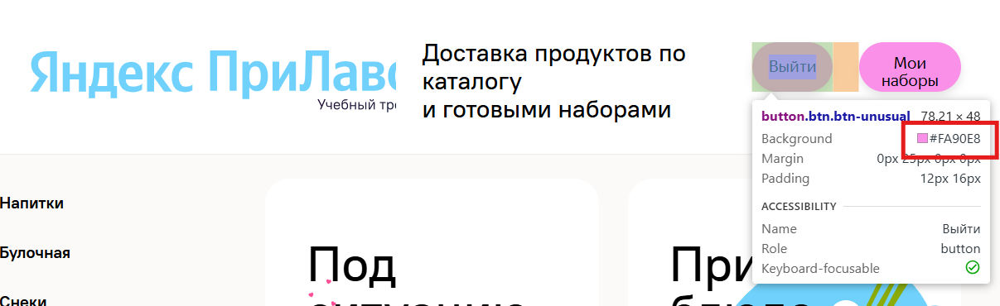

---

## БР56: Внешний вид шапки авторизованного пользователя: кнопки «Выйти» и «Мои наборы» розового цвета #fa90e9

**Предусловия:** Пользователь зарегистрирован, авторизован

**Шаги воспроизведения:**
1. Обратить внимание на шапку сайта

**Ожидаемый результат:** Кнопка «Выйти» зеленого цвета #EFEA34, кнопка «Мои наборы» розового цвета #fa90e9

**Фактический результат:** Кнопки одинакового розового цвета #fa90e9

**Окружение:** Windows 11 Pro, Firefox 154.0.1 1280x720

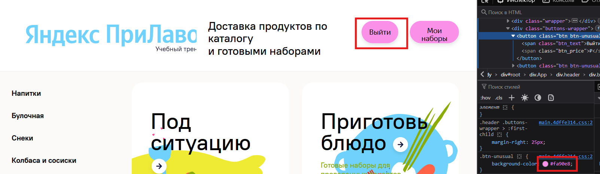

---

## БР57: Форма регистрации перекрывается надписями главной страницы

**Предусловия:** Пользователь не зарегистрирован

**Шаги воспроизведения:**
1. Открыть главную страницу
2. Нажать в шапке сайта в правом верхнем углу кнопку "Зарегистрироваться"

**Ожидаемый результат:** Форма регистрации не перекрывается надписями или картинками

**Фактический результат:** Форма регистрации перекрывается надписями главной страницы

**Окружение:** Windows 11 Pro, Google Chrome 152.0.7977.65 1920x1080

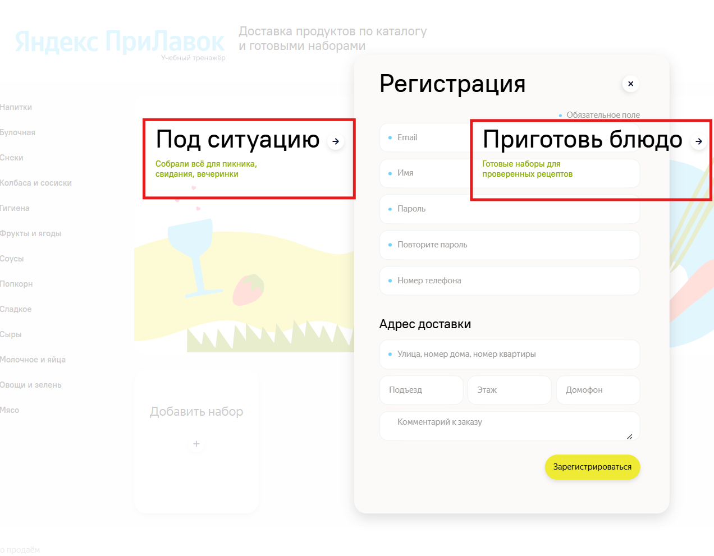

---

## БР58: Форма регистрации перекрывается надписями главной страницы

**Предусловия:** Пользователь не зарегистрирован

**Шаги воспроизведения:**
1. Открыть главную страницу
2. Нажать в шапке сайта в правом верхнем углу кнопку "Зарегистрироваться"

**Ожидаемый результат:** Форма регистрации не перекрывается надписями или картинками

**Фактический результат:** Форма регистрации перекрывается надписями главной страницы

**Окружение:** Windows 11 Pro, Firefox 154.0.1 1280x720

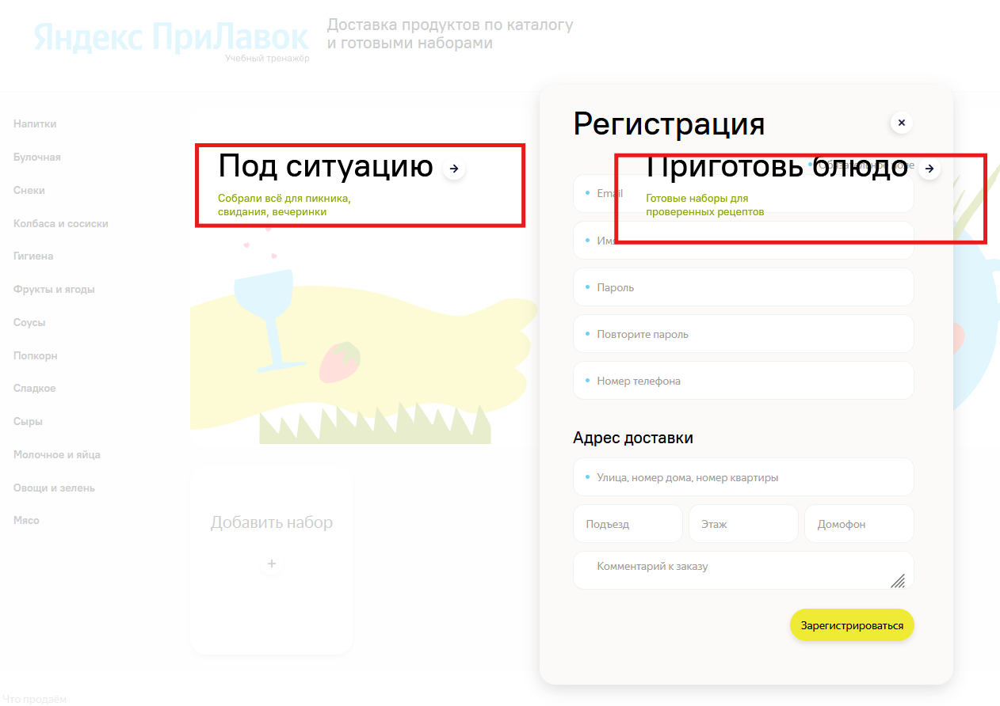

---

## БР59: При регистрации при незаполненном поле "Номер телефона" кнопка "Зарегистрироваться" активна

**Предусловия:** Пользователь не зарегистрирован

**Шаги воспроизведения:**
1. Открыть главную страницу
2. Нажать в шапке сайта в правом верхнем углу кнопку "Зарегистрироваться"
3. Заполнить обязательные поля валидными данными
4. Поле "Номер телефона" оставить пустым
5. Внизу формы обратить внимание на активность кнопки "Зарегистрироваться"

**Ожидаемый результат:** Кнопка «Зарегистрироваться» недоступна для нажатия

**Фактический результат:** Кнопка «Зарегистрироваться» доступна для нажатия

**Окружение:** Windows 11 Pro, Google Chrome 152.0.7977.65 1920x1080

---

## БР60: При регистрации при незаполненном поле "Номер телефона" происходит неверная реакция поля

**Предусловия:** Пользователь не зарегистрирован

**Шаги воспроизведения:**
1. Открыть главную страницу
2. Нажать в шапке сайта в правом верхнем углу кнопку "Зарегистрироваться"
3. Заполнить обязательные поля валидными данными
4. Поле "Номер телефона" оставить пустым и обратить внимание на поле

**Ожидаемый результат:** В поле "Номер телефона" появляется красная точка

**Фактический результат:** В поле "Номер телефона" не появляется красная точка

**Окружение:** Windows 11 Pro, Google Chrome 152.0.7977.65 1920x1080

---

## БР61: При регистрации при незаполненном поле "Номер телефона" не появляется сообщение "Заполните все обязательные поля"

**Предусловия:** Пользователь не зарегистрирован

**Шаги воспроизведения:**
1. Открыть главную страницу
2. Нажать в шапке сайта в правом верхнем углу кнопку "Зарегистрироваться"
3. Заполнить обязательные поля валидными данными
4. Поле "Номер телефона" оставить пустым и обратить внимание на надпись под полем и всеми полями формы

**Ожидаемый результат:** Под всеми полями появляется сообщение «Заполните все обязательные поля»

**Фактический результат:** Под всеми полями не появляется сообщение «Заполните все обязательные поля»

**Окружение:** Windows 11 Pro, Google Chrome 152.0.7977.65 1920x1080

---

## БР62: При регистрации при незаполненном поле "Номер телефона" кнопка "Зарегистрироваться" активна

**Предусловия:** Пользователь не зарегистрирован

**Шаги воспроизведения:**
1. Открыть главную страницу
2. Нажать в шапке сайта в правом верхнем углу кнопку "Зарегистрироваться"
3. Заполнить обязательные поля валидными данными
4. Поле "Номер телефона" оставить пустым
5. Внизу формы обратить внимание на активность кнопки "Зарегистрироваться"

**Ожидаемый результат:** Кнопка «Зарегистрироваться» недоступна для нажатия

**Фактический результат:** Кнопка «Зарегистрироваться» доступна для нажатия

**Окружение:** Windows 11 Pro, Firefox 154.0.1 1280x720

---

## БР63: При регистрации при незаполненном поле "Номер телефона" происходит неверная реакция поля

**Предусловия:** Пользователь не зарегистрирован

**Шаги воспроизведения:**
1. Открыть главную страницу
2. Нажать в шапке сайта в правом верхнем углу кнопку "Зарегистрироваться"
3. Заполнить обязательные поля валидными данными
4. Поле "Номер телефона" оставить пустым и обратить внимание на поле

**Ожидаемый результат:** В поле "Номер телефона" появляется красная точка

**Фактический результат:** В поле "Номер телефона" не появляется красная точка

**Окружение:** Windows 11 Pro, Firefox 154.0.1 1280x720

---

## БР64: При регистрации при незаполненном поле "Номер телефона" не появляется сообщение "Заполните все обязательные поля"

**Предусловия:** Пользователь не зарегистрирован

**Шаги воспроизведения:**
1. Открыть главную страницу
2. Нажать в шапке сайта в правом верхнем углу кнопку "Зарегистрироваться"
3. Заполнить обязательные поля валидными данными
4. Поле "Номер телефона" оставить пустым и обратить внимание на надпись под полем и всеми полями формы

**Ожидаемый результат:** Под всеми полями появляется сообщение «Заполните все обязательные поля»

**Фактический результат:** Под всеми полями не появляется сообщение «Заполните все обязательные поля»

**Окружение:** Windows 11 Pro, Firefox 154.0.1 1280x720

---

## БР65: При повороте экрана приложение закрывается

**Предусловия:** Приложение запущено

**Шаги воспроизведения:**
1. Выполнить поворот экрана в ландшафтный режим
2. Выполнить поворот экрана обратно в портретный режим

**Ожидаемый результат:** Данные не сбрасываются, интерфейс перестраивается корректно

**Фактический результат:** Приложение закрывается

**Окружение:** Эмулятор: Google APIs, 35.0 x86-64, arm64-v8a
Версия Android: 15
Яндекс Прилавок 1.0

---

## БР66: При включение/выключении режима полета не высвечивается сообщение "Нет соединения"

**Предусловия:** Приложение запущено

**Шаги воспроизведения:**
1. Включить режим полета
2. Выключить режим полета

**Ожидаемый результат:** Приложение не падает, показывает ошибку «Нет соединения»

**Фактический результат:** Ошибка не показывается

**Окружение:** Эмулятор: Google APIs, 35.0 x86-64, arm64-v8a
Версия Android: 15
Яндекс Прилавок 1.0

---

## БР67: При отключении Интернета не высвечивается сообщение "Нет соединения"

**Предусловия:** Приложение запущено

**Шаги воспроизведения:**
1. Отключить Интернет через панель эмулятора

**Ожидаемый результат:** Приложение показывает ошибку «Нет соединения» или аналогичное сообщение, не падает

**Фактический результат:** Ошибка не показывается

**Окружение:** Эмулятор: Google APIs, 35.0 x86-64, arm64-v8a
Версия Android: 15
Яндекс Прилавок 1.0

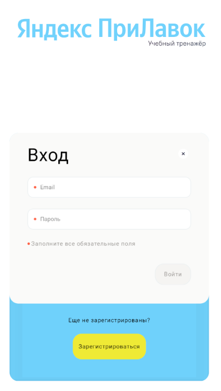

---

## БР68: Форма регистрации перекрывается надписями главной страницы

**Предусловия:** Пользователь не зарегистрирован

**Шаги воспроизведения:**
1. Открыть главную страницу
2. Нажать в шапке сайта в правом верхнем углу кнопку "Зарегистрироваться"

**Ожидаемый результат:** Форма регистрации не перекрывается надписями или картинками

**Фактический результат:** Форма регистрации перекрывается надписями главной страницы

**Окружение:** Windows 11 Pro, Google Chrome 152.0.7977.65 768x1024

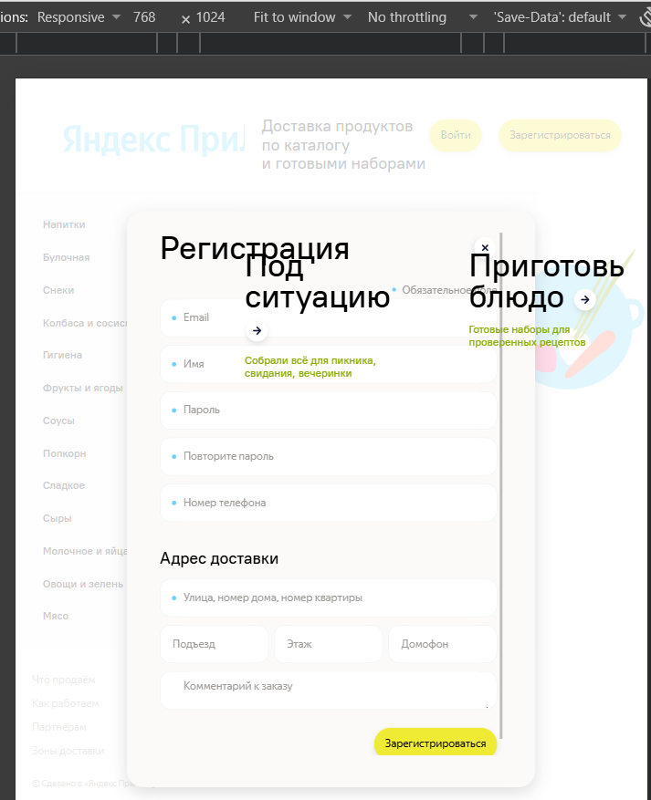

---
