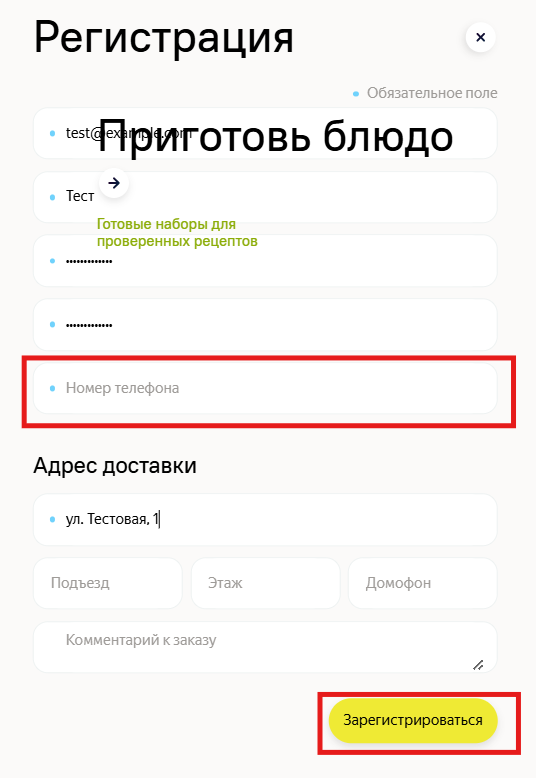
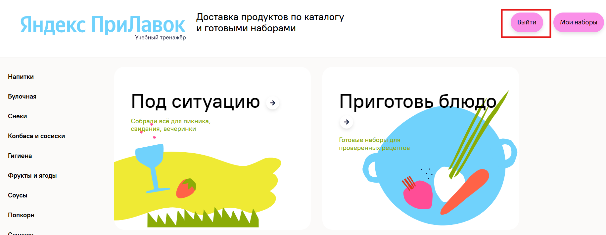
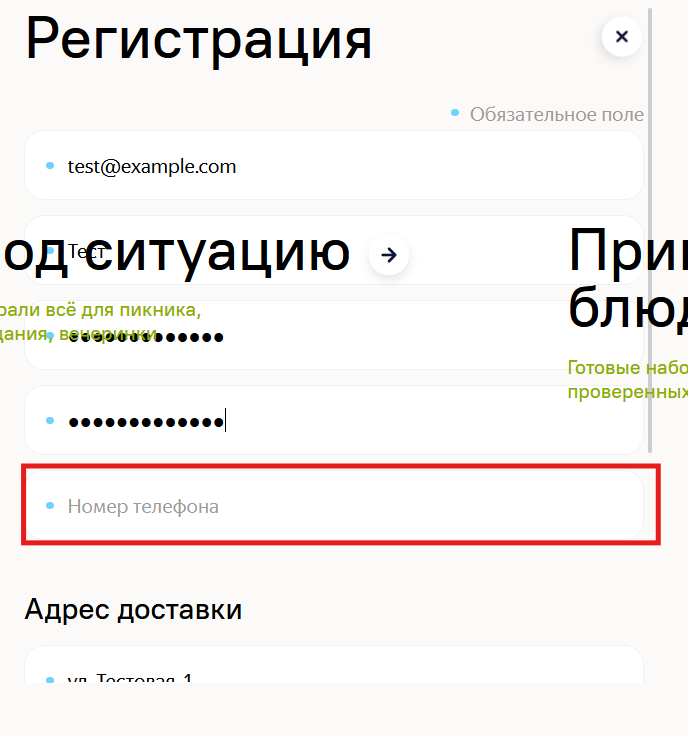
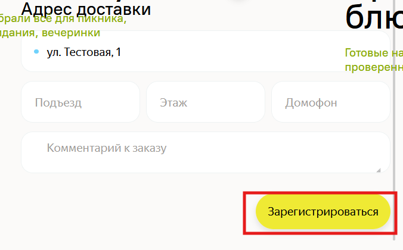
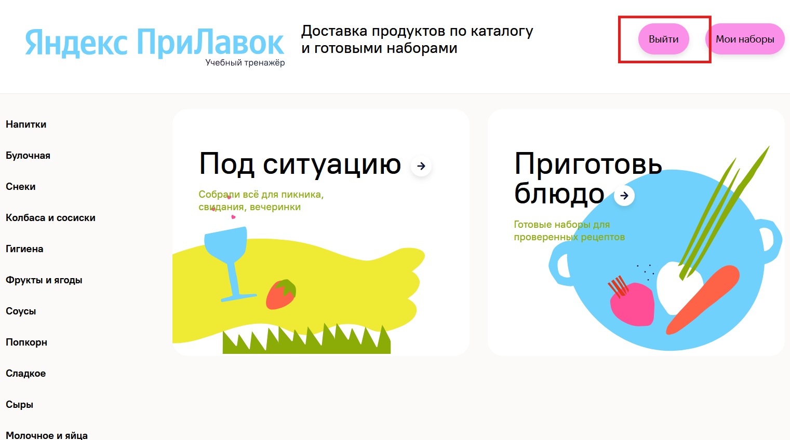
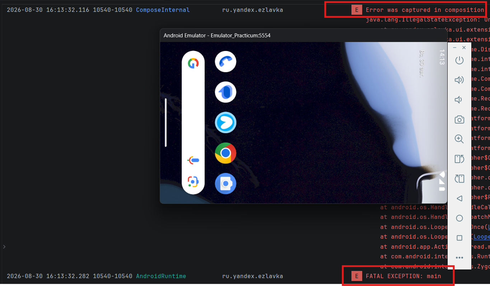
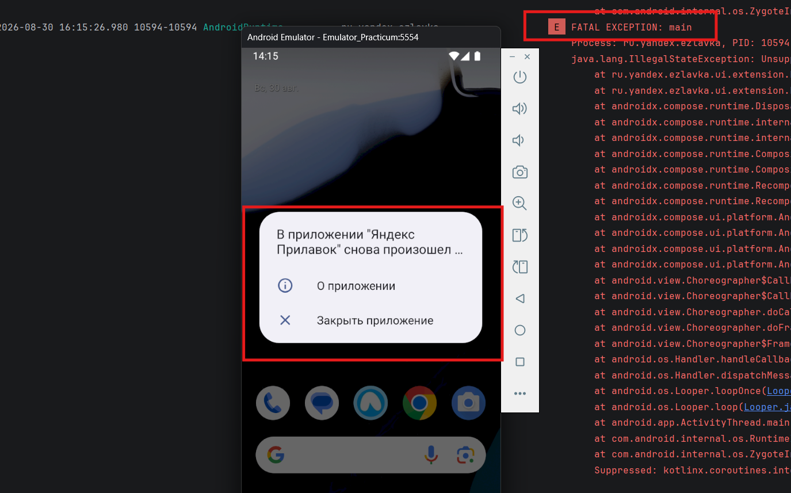

# Баг-репорты

## БР37: Происходит регистрация при незаполненном поле "Номер телефона"

**Предусловия:** Пользователь не зарегистрирован

**Шаги воспроизведения:**
1. Открыть главную страницу
2. Нажать в шапке сайта в правом верхнем углу кнопку "Зарегистрироваться"
3. Заполнить обязательные поля валидными данными
4. Поле "Номер телефона" оставить пустым
5. Нажать под полями формы кнопку "Зарегистрироваться"

**Ожидаемый результат:** Кнопка «Зарегистрироваться» недоступна для нажатия, регистрация не происходит

**Фактический результат:** Происходит регистрация и переход на главную страницу

**Окружение:** Windows 11 Pro, Google Chrome 152.0.7977.65 1920x1080

---

## БР38: Происходит регистрация при незаполненном поле "Номер телефона"

**Предусловия:** Пользователь не зарегистрирован

**Шаги воспроизведения:**
1. Открыть главную страницу
2. Нажать в шапке сайта в правом верхнем углу кнопку "Зарегистрироваться"
3. Заполнить обязательные поля валидными данными
4. Поле "Номер телефона" оставить пустым
5. Нажать под полями формы кнопку "Зарегистрироваться"

**Ожидаемый результат:** Кнопка «Зарегистрироваться» недоступна для нажатия, регистрация не происходит

**Фактический результат:** Происходит регистрация и переход на главную страницу

**Окружение:** Windows 11 Pro, Firefox 154.0.1 1280x720

---

## БР45: Запрос POST api/v1/users с пустым полем phone возвращает ответ 201 Created

**Предусловия:** Пользователь не зарегистрирован

**Шаги воспроизведения:**
1. В Postman сформировать запрос POST api/v1/users с адресом сервиса: { "firstName": "", "phone": "", "address": "", "email": "", "password": "" }
2. Заполнить все поля валидными данными
3. Поле phone оставить пустым
4. Отправить запрос

**Ожидаемый результат:** Запрос возвращает ответ 400 Bad request

**Фактический результат:** Запрос возвращает ответ 201 Created

**Окружение:** Postman

---

## БР46: При регистрации с незаполненным полем "Телефон" данные сохраняются в базу данных

**Предусловия:** Пользователь зарегистрирован

**Шаги воспроизведения:**
1. Подключиться к сервису в DBeaver
2. Сформировать запрос с почтой зарегистрированного пользователя SELECT * FROM user_model WHERE email = '';
3. Отправить запрос

**Ожидаемый результат:** Данные не сохранены в БД

**Фактический результат:** Данные сохранены в БД

**Окружение:** DBeaver

---

## БР57: Форма регистрации перекрывается надписями главной страницы

**Предусловия:** Пользователь не зарегистрирован

**Шаги воспроизведения:**
1. Открыть главную страницу
2. Нажать в шапке сайта в правом верхнем углу кнопку "Зарегистрироваться"

**Ожидаемый результат:** Форма регистрации не перекрывается надписями или картинками

**Фактический результат:** Форма регистрации перекрывается надписями главной страницы

**Окружение:** Windows 11 Pro, Google Chrome 152.0.7977.65 1920x1080

---

## БР58: Форма регистрации перекрывается надписями главной страницы

**Предусловия:** Пользователь не зарегистрирован

**Шаги воспроизведения:**
1. Открыть главную страницу
2. Нажать в шапке сайта в правом верхнем углу кнопку "Зарегистрироваться"

**Ожидаемый результат:** Форма регистрации не перекрывается надписями или картинками

**Фактический результат:** Форма регистрации перекрывается надписями главной страницы

**Окружение:** Windows 11 Pro, Firefox 154.0.1 1280x720

---

## БР68: Форма регистрации перекрывается надписями главной страницы

**Предусловия:** Пользователь не зарегистрирован

**Шаги воспроизведения:**
1. Открыть главную страницу
2. Нажать в шапке сайта в правом верхнем углу кнопку "Зарегистрироваться"

**Ожидаемый результат:** Форма регистрации не перекрывается надписями или картинками

**Фактический результат:** Форма регистрации перекрывается надписями главной страницы

**Окружение:** Windows 11 Pro, Google Chrome 152.0.7977.65 768x1024

---

## БР65: При повороте экрана приложение закрывается

**Предусловия:** Приложение запущено

**Шаги воспроизведения:**
1. Выполнить поворот экрана в ландшафтный режим
2. Выполнить поворот экрана обратно в портретный режим

**Ожидаемый результат:** Данные не сбрасываются, интерфейс перестраивается корректно

**Фактический результат:** Приложение закрывается

**Окружение:** Эмулятор: Google APIs, 35.0 x86-64, arm64-v8a Версия Android: 15 Яндекс Прилавок 1.0

---

## БР47: При прокрутке формы регистрации не появляется футер формы: ссылка «У вас уже есть аккаунт» и кнопка «Войти»

**Предусловия:** Пользователь не зарегистрирован

**Шаги воспроизведения:**
1. Открыть главную страницу
2. Нажать в шапке сайта в правом верхнем углу кнопку "Зарегистрироваться"
3. Обратить внимание на нижнюю часть формы регистрации

**Ожидаемый результат:** При прокрутке формы регистрации появляется футер формы: ссылка «У вас уже есть аккаунт» и кнопка «Войти»

**Фактический результат:** При прокрутке формы регистрации не появляется футер формы: ссылка «У вас уже есть аккаунт» и кнопка «Войти»

**Окружение:** Windows 11 Pro, Google Chrome 152.0.7977.65 1920x1080

---

## БР48: При прокрутке формы регистрации не появляется футер формы: ссылка «У вас уже есть аккаунт» и кнопка «Войти»

**Предусловия:** Пользователь не зарегистрирован

**Шаги воспроизведения:**
1. Открыть главную страницу
2. Нажать в шапке сайта в правом верхнем углу кнопку "Зарегистрироваться"
3. Обратить внимание на нижнюю часть формы регистрации

**Ожидаемый результат:** При прокрутке формы регистрации появляется футер формы: ссылка «У вас уже есть аккаунт» и кнопка «Войти»

**Фактический результат:** При прокрутке формы регистрации не появляется футер формы: ссылка «У вас уже есть аккаунт» и кнопка «Войти»

**Окружение:** Firefox (версия 154.0.1) 1280x720

---

## БР3: При успешной регистрации не появляется сообщение об успешной регистрации, сразу происходит переход на главную страницу

**Предусловия:** Пользователь не зарегистрирован

**Шаги воспроизведения:**
1. Открыть главную страницу
2. Нажать в шапке сайта в правом верхнем углу кнопку "Зарегистрироваться"
3. Заполнить обязательные поля валидными данными
4. Внизу формы нажать кнопку "Зарегистрироваться"

**Ожидаемый результат:** Появляется попап с сообщением «Всё получилось!» и крестиком закрытия

**Фактический результат:** Сразу происходит переход на главную страницу

**Окружение:** Windows 11 Pro, Google Chrome 152.0.7977.65 1920x1080

---

## БР4: При успешной регистрации не появляется сообщение об успешной регистрации, сразу происходит переход на главную страницу

**Предусловия:** Пользователь не зарегистрирован

**Шаги воспроизведения:**
1. Открыть главную страницу
2. Нажать в шапке сайта в правом верхнем углу кнопку "Зарегистрироваться"
3. Заполнить обязательные поля валидными данными
4. Внизу формы нажать кнопку "Зарегистрироваться"

**Ожидаемый результат:** Появляется попап с сообщением «Всё получилось!» и крестиком закрытия

**Фактический результат:** Сразу происходит переход на главную страницу

**Окружение:** Windows 11 Pro, Firefox 154.0.1 1280x720

---

## БР23: На странице регистрации нет ссылки "У вас уже есть аккаунт? Войти"

**Предусловия:** Пользователь зарегистрирован, не авторизован

**Шаги воспроизведения:**
1. Открыть главную страницу
2. Нажать в шапке сайта в правом верхнем углу кнопку "Зарегистрироваться"
3. Внизу формы регистрации нажать ссылку "У вас уже есть аккаунт? Войти"

**Ожидаемый результат:** Переход на экран авторизации

**Фактический результат:** Отсутствует ссылка "У вас уже есть аккаунт? Войти"

**Окружение:** Windows 11 Pro, Google Chrome 152.0.7977.65 1920x1080

---

## БР24: На странице регистрации нет ссылки "У вас уже есть аккаунт? Войти"

**Предусловия:** Пользователь зарегистрирован, не авторизован

**Шаги воспроизведения:**
1. Открыть главную страницу
2. Нажать в шапке сайта в правом верхнем углу кнопку "Зарегистрироваться"
3. Обратить внимание на нижнюю часть формы регистрации

**Ожидаемый результат:** Переход на экран авторизации

**Фактический результат:** Отсутствует ссылка "У вас уже есть аккаунт? Войти"

**Окружение:** Windows 11 Pro, Firefox 154.0.1 1280x720

---

## БР25: При авторизации с пустым Email при нажатии кнопки «Войти» под полем «Email» появляется сообщение об ошибке красным текстом: «Обязательное поле»

**Предусловия:** Пользователь зарегистрирован, не авторизован

**Шаги воспроизведения:**
1. Открыть главную страницу
2. Нажать в шапке сайта в правом верхнем углу кнопку "Войти"
3. Заполнить поле "Пароль" валидными данными зарегистрированного пользователя
4. Поле Email оставить пустым
5. Нажать кнопку "Войти" внизу формы
6. Обратить внимание на надпись под полем Email

**Ожидаемый результат:** Появляется сообщение об ошибке красным текстом: «Email является обязательным»

**Фактический результат:** Появляется сообщение об ошибке красным текстом: «Обязательное поле»

**Окружение:** Windows 11 Pro, Google Chrome 152.0.7977.65 1920x1080

---

## БР26: При авторизации с пустым Email при нажатии кнопки «Войти» под полем «Email» появляется сообщение об ошибке красным текстом: «Обязательное поле»

**Предусловия:** Пользователь зарегистрирован, не авторизован

**Шаги воспроизведения:**
1. Открыть главную страницу
2. Нажать в шапке сайта в правом верхнем углу кнопку "Войти"
3. Заполнить поле "Пароль" валидными данными зарегистрированного пользователя
4. Поле Email оставить пустым
5. Нажать кнопку "Войти" внизу формы
6. Обратить внимание на надпись под полем Email

**Ожидаемый результат:** Появляется сообщение об ошибке красным текстом: «Email является обязательным»

**Фактический результат:** Появляется сообщение об ошибке красным текстом: «Обязательное поле»

**Окружение:** Windows 11 Pro, Firefox 154.0.1 1280x720

---

## БР55: Внешний вид шапки авторизованного пользователя: кнопка «Выйти» розового цвета #fa90e8

**Предусловия:** Пользователь зарегистрирован, авторизован

**Шаги воспроизведения:**
1. Обратить внимание на шапку сайта, кнопку "Выйти"

**Ожидаемый результат:** Кнопка зеленого цвета #EFEA34

**Фактический результат:** Кнопка розового цвета #fa90e8

**Окружение:** Windows 11 Pro, Google Chrome 152.0.7977.65 1920x1080

---

## БР56: Внешний вид шапки авторизованного пользователя: кнопки «Выйти» и «Мои наборы» розового цвета #fa90e9

**Предусловия:** Пользователь зарегистрирован, авторизован

**Шаги воспроизведения:**
1. Обратить внимание на шапку сайта

**Ожидаемый результат:** Кнопка «Выйти» зеленого цвета #EFEA34, кнопка «Мои наборы» розового цвета #fa90e9

**Фактический результат:** Кнопки одинакового розового цвета #fa90e9

**Окружение:** Windows 11 Pro, Firefox 154.0.1 1280x720

---

## БР1: Неверный порядок полей в форме регистрации

**Предусловия:** Пользователь не зарегистрирован

**Шаги воспроизведения:**
1. Открыть главную страницу
2. Нажать в шапке сайта в правом верхнем углу кнопку "Зарегистрироваться"
3. Обратить внимание на порядок полей формы регистрации

**Ожидаемый результат:** В форме регистрации присутствуют поля в порядке: Имя → Номер телефона → E-mail → Пароль → Повторите пароль → Адрес доставки → Комментарий к заказу

**Фактический результат:** В форме регистрации присутствуют поля в порядке: E-mail → Имя → Пароль → Повторите пароль → Номер телефона → Адрес доставки → Комментарий к заказу

**Окружение:** Windows 11 Pro, Google Chrome 152.0.7977.65 1920x1080

---

## БР2: Неверный порядок полей в форме регистрации

**Предусловия:** Пользователь не зарегистрирован

**Шаги воспроизведения:**
1. Открыть главную страницу
2. Нажать в шапке сайта в правом верхнем углу кнопку "Зарегистрироваться"
3. Обратить внимание на порядок полей формы регистрации

**Ожидаемый результат:** В форме регистрации присутствуют поля в порядке: Имя → Номер телефона → E-mail → Пароль → Повторите пароль → Адрес доставки → Комментарий к заказу

**Фактический результат:** В форме регистрации присутствуют поля в порядке: E-mail → Имя → Пароль → Повторите пароль → Номер телефона → Адрес доставки → Комментарий к заказу

**Окружение:** Windows 11 Pro, Firefox 154.0.1 1280x720

---

## БР66: При включении/выключении режима полета не высвечивается сообщение "Нет соединения"

**Предусловия:** Приложение запущено

**Шаги воспроизведения:**
1. Включить режим полета
2. Выключить режим полета

**Ожидаемый результат:** Приложение не падает, показывает ошибку «Нет соединения»

**Фактический результат:** Ошибка не показывается

**Окружение:** Эмулятор: Google APIs, 35.0 x86-64, arm64-v8a Версия Android: 15 Яндекс Прилавок 1.0

---

## БР67: При отключении Интернета не высвечивается сообщение "Нет соединения"

**Предусловия:** Приложение запущено

**Шаги воспроизведения:**
1. Отключить Интернет через панель эмулятора

**Ожидаемый результат:** Приложение показывает ошибку «Нет соединения» или аналогичное сообщение, не падает

**Фактический результат:** Ошибка не показывается

**Окружение:** Эмулятор: Google APIs, 35.0 x86-64, arm64-v8a Версия Android: 15 Яндекс Прилавок 1.0

---
